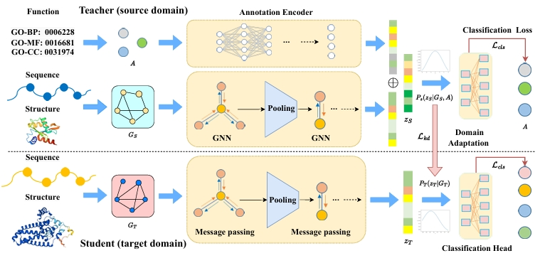

# ProtGO
ProtGO: Function-Guided Protein Modeling for Unified Representation Learning.

[[paper]](https://proceedings.neurips.cc/paper_files/paper/2024/hash/a1722a6bd1023c026a3d6a570fb3af75-Abstract-Conference.html)




## File Specification


## Dependencies
PyTorch 1.13.1

PyG, transformers

torch-geometric

pip install transformers

PyTorch Scatter

...


### License
The code is released under MIT License.


### Related Repos
Thanks for these great work:

1. [CDConv](https://github.com/hehefan/Continuous-Discrete-Convolution) &emsp; 2. [GearNet](https://github.com/DeepGraphLearning/GearNet) 

### Citation
```
@article{hu2024protgo,
  title={Protgo: Function-guided protein modeling for unified representation learning},
  author={Hu, Bozhen and Tan, Cheng and Xu, Yongjie and Gao, Zhangyang and Xia, Jun and Wu, Lirong and Li, Stan Z},
  journal={Advances in Neural Information Processing Systems},
  volume={37},
  pages={88581--88604},
  year={2024}
}
```

